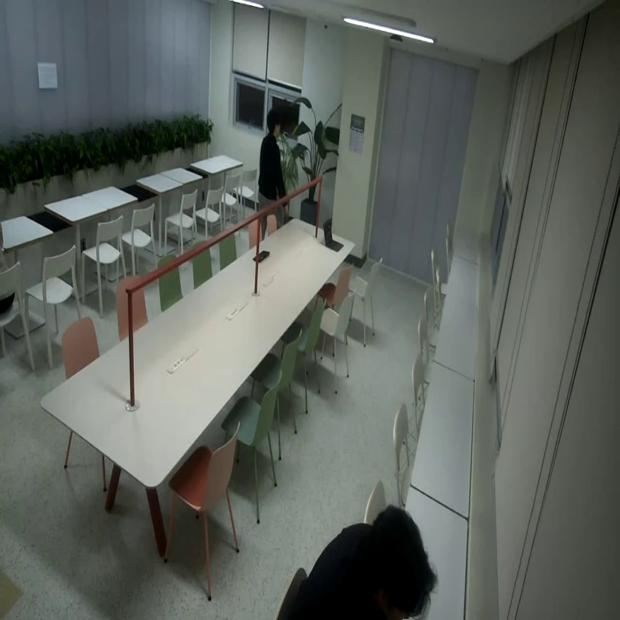
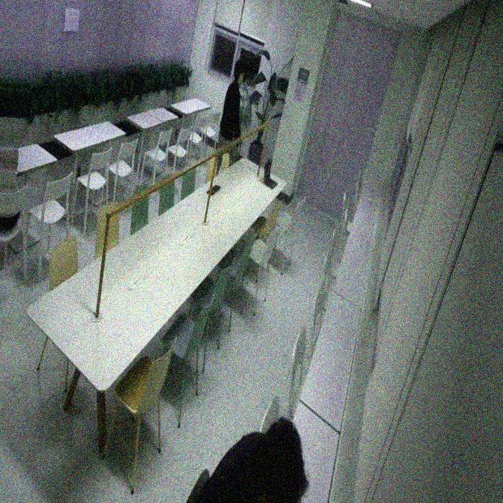

# Image_augmentation

----

resize (620x620)

flip left and right (random.random() < 0.5), flip up and down (random.random() < 0.5)

Brightness (0.8 to 1.2) (this range is chosen because beyond this range, the labeling becomes hard to read for many samples)

Saturation (0.8-1.2) (don't go too high or you won't see much color difference)

Color (+-30 (based on opencv BRG))

Shear 50 degree

<h3> Augmenting an image taken using the Raspberry Pi Camera Module 3 wires. </h3>

 

Before Image

After Image

 
<h2> file_divide</h2>

---

Separate the files you created into as many folders as you want to assign labels to team members. 

This is done by pulling out the filenames as numbers, filling the previous folder in ascending order, and creating the next folder to fill it.

<h3> folder create example</h3>

