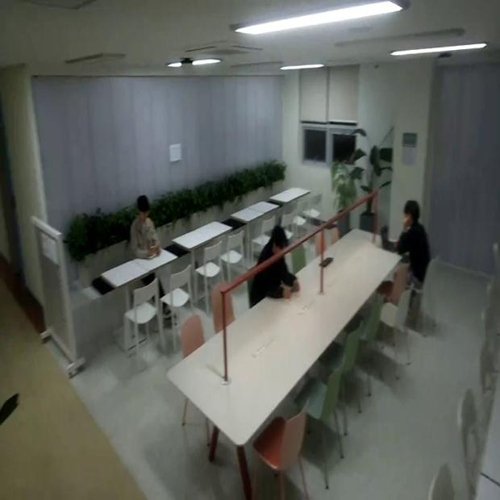
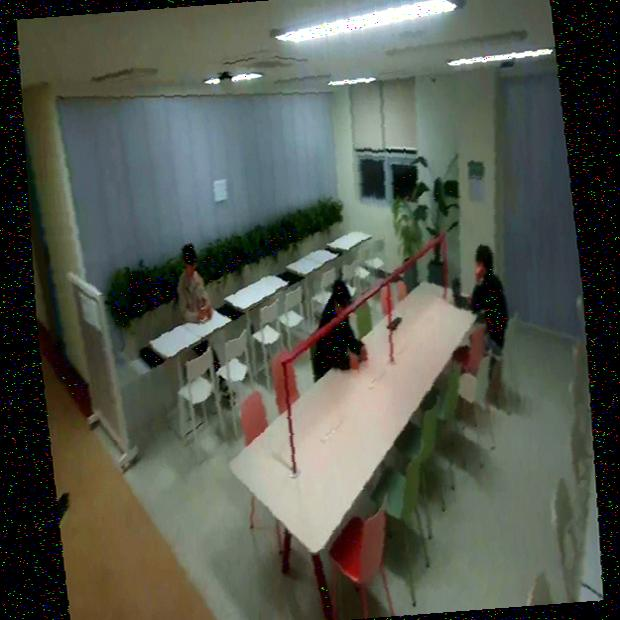
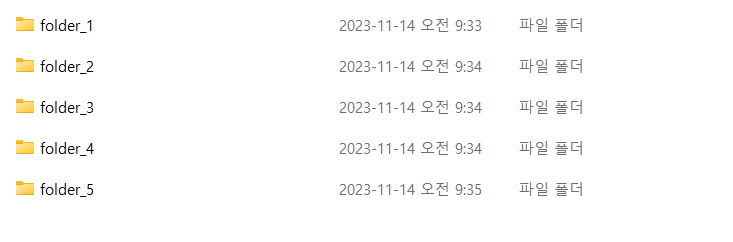

# augmentation
opencv를 사용하여

resize (620x620)

좌우 반전(random.random() < 0.5)

밝기(0.7~1.5)(이 범위를 넘으면 labelling이 눈으로 인식하기 힘든 sample들이 많아져서 해당범위로 지정)

채도(0.5~2.0)

색상(-8~8)

전단변화(검은 여백 존재)

기울기(-10~10)(전단변화와 함께 사용하니 왜곡이 너무 심해져서 범위를 좁게 지정)

filtering(가우시안 노이즈)

  
<h3> 라즈베리파이 카메라모듈 3 와이드를 사용하여 촬영한 Image를 augmentation한 결과</h3>

Before Image

 

After Image

# file_divide
팀원의 labelling 할당을 위해서 생성한 파일을 원하는 수(폴더의 수)만큼 분리함 

이때 파일명을 숫자로 꺼내서 오름차순 정렬으로 이전 폴더를 채우고 다음 폴더를 생성하여 채우는 방식

  
<h3> folder 생성 예시</h3>

